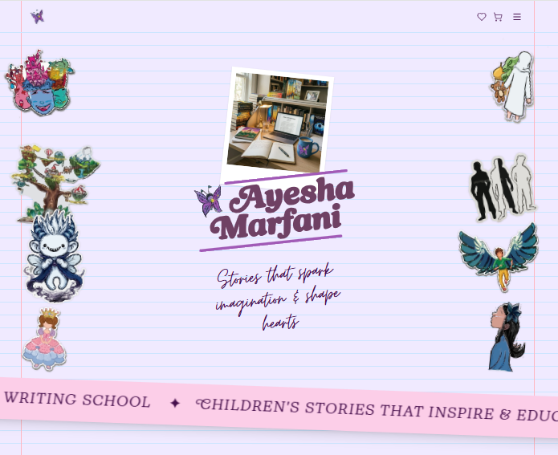

# Author Website Redesign

A redesigned children's author website for Ayesha Marfani, built using my web development skills with the help of AI for CSS styling and design decisions.

## About

This project is a redesign of an existing children's author website. I used my web development skills along with AI assistance for CSS to create a modern, clean design that maintains the whimsical feel appropriate for a children's book author's site.



## Features

- Responsive navigation with mobile menu
- Custom font integration (moontime, newKansas, Courier Prime)
- Torn paper edge effects
- Notebook-lined background
- SVG footer decoration
- Wishlist and cart functionality

## How to Run Locally

1. Clone the repository
2. Open `index.html` in your browser
3. No build step required - it's pure HTML/CSS/JS

```bash
git clone https://github.com/muhammad-bin-junaid/author-redesighn.git
cd author-redesighn
open index.html
```

## Live Demo

[Open Site](https://author-redesighn.vercel.app)

## GitHub

[Repository](https://github.com/muhammad-bin-junaid/author-redesighn)

## Tech Stack

- HTML5
- CSS3 (Tailwind CSS)
- Vanilla JavaScript
- Google Fonts & custom OTF fonts